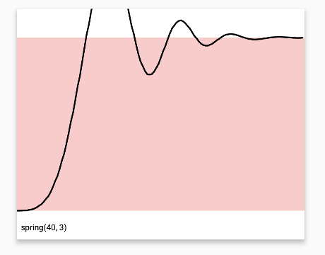

betwixt
======

**Betwixt** _(/bɪˈtwɪkst/ - preposition & adverb - archaic term for between)_ is an
android library that aims to provide a unified composable api for animation
Interpolators, both provided already by the platform and for new ones provided
by the community

Demo
======

To see some interpolators in action and examples of how _betwixt_ allows composing of different
interpolators, try downloading the demo app from Google Play™

<a href='https://play.google.com/store/apps/details?id=com.savvasdalkitsis.betwixt&utm_source=global_co&utm_medium=prtnr&utm_content=Mar2515&utm_campaign=PartBadge&pcampaignid=MKT-Other-global-all-co-prtnr-py-PartBadge-Mar2515-1'>

</a>

or you can try an online demo here (note that performance of the online demo may not be sufficient to
see smooth animations)

[](https://appetize.io/app/p3848n7h6b950hzkxezyg5x06m?device=hammerhead&scale=50&orientation=portrait&osVersion=6.0.1)

syntax
======

**Betwixt** provides a fluent syntax for creating and composing interpolators,
including ones provided by the Android platform, such as:

```java
linear()
```


```java
fastOutSlowIn()
```


but also new custom ones:

```java
step()
```


The library's power, though, comes from its composable interpolators.
These allow you to create complex animations like:

```java
pingPong(accelerateDecelerate())
```


and

```java
join(accelerateDecelerate(), flip(bounce()))
```


betwixt-rebound
======

This extension to the library allows integration with the Facebook library
[rebound](http://facebook.github.io/rebound/) to allow creation of interpolators backed by a Spring

```java
spring(40,3)
```


Download
======

The library is available on **JCenter**. Note that it is still in early development and things might
change with subsequent versions.

To use it in your project, add the following to your project

- Gradle:
```groovy
compile 'com.savvasdalkitsis:betwixt:1.0.0'
```
- Maven:
```xml
<dependency>
  <groupId>com.savvasdalkitsis</groupId>
  <artifactId>betwixt</artifactId>
  <version>1.0.0</version>
</dependency>
```

for `betwixt-rebound` you can use:

- Gradle:
```groovy
compile 'com.savvasdalkitsis:betwixt-rebound:1.0.0'
```
- Maven:
```xml
<dependency>
  <groupId>com.savvasdalkitsis</groupId>
  <artifactId>betwixt-rebound</artifactId>
  <version>1.0.0</version>
</dependency>
```

License
-------

    Copyright 2016 Savvas Dalkitsis

    Licensed under the Apache License, Version 2.0 (the "License");
    you may not use this file except in compliance with the License.
    You may obtain a copy of the License at

       http://www.apache.org/licenses/LICENSE-2.0

    Unless required by applicable law or agreed to in writing, software
    distributed under the License is distributed on an "AS IS" BASIS,
    WITHOUT WARRANTIES OR CONDITIONS OF ANY KIND, either express or implied.
    See the License for the specific language governing permissions and
    limitations under the License.